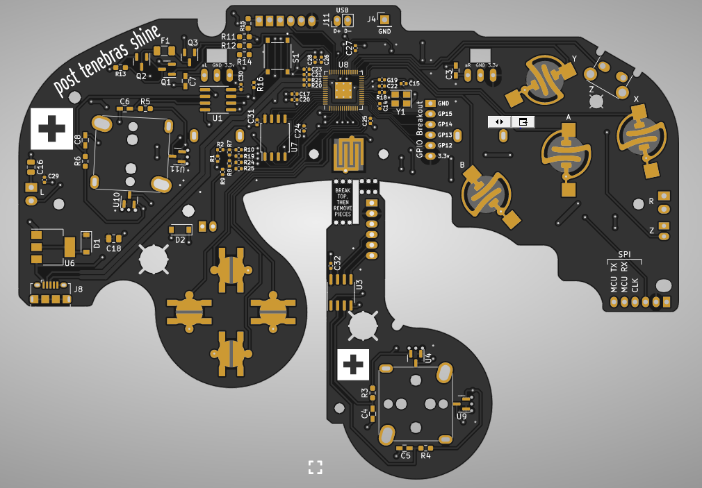
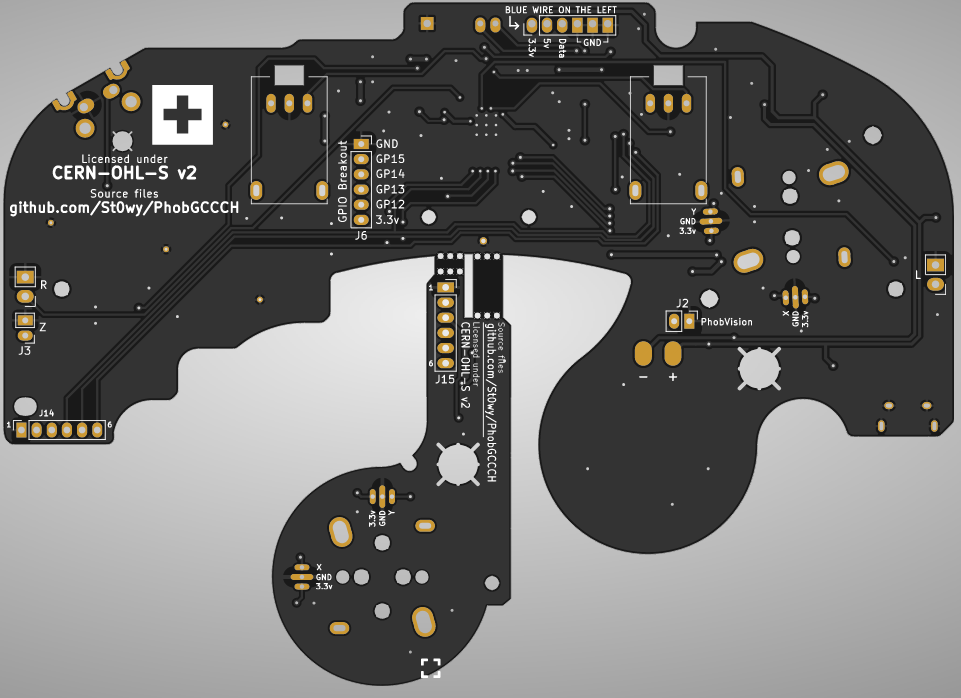

# PhobGCC Swiss Edition

Repository for the modifications made for the swiss group order of the PhobGCC 2.0.2 boards.

We added a swiss cross on the board and removed the phob logo.

Thanks to joedalton17 on the swiss melee discord for adding them !

The PhobGCC v2.0 board is licensed under CERN Open Hardware Licence Version 2 - Strongly Reciprocal.
This means that any changes made to the board should be made public and CHANGES.txt be updated to reflect said changes.
